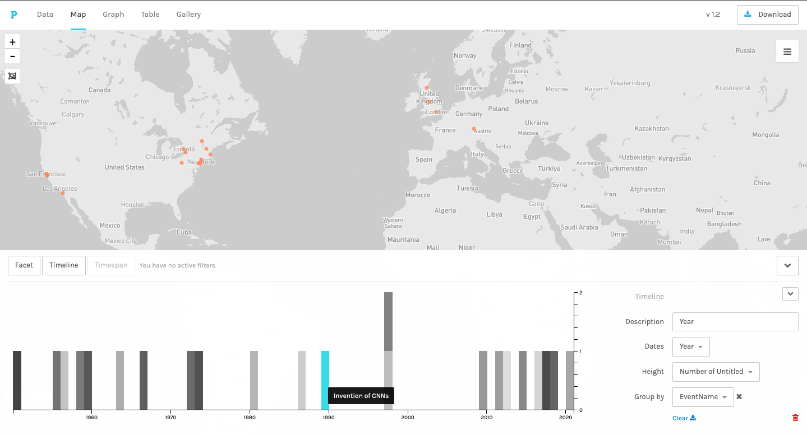
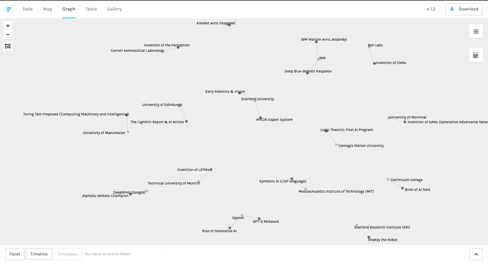

# An Interactive Visualization of AI History

This project explores the history of Artificial Intelligence from its conceptual beginnings to the modern era of generative models. The data was compiled and visualized using Palladio to show the key institutions behind major breakthroughs, where these events happened, and how they unfold over time.

---

### Dashboard Views

| Map View | Graph View | Gallery View |
| :---: | :---: | :---: |
|  |  |  |

---

## About the Data

The dataset contains 22 major milestones in the history of AI. Each entry includes:
*   The event name and a short subtitle.
*   The year of the event.
*   The location of the event.
*   The primary institution or company responsible.
*   Links to relevant Wikipedia articles.

**The raw data used for this project is in the file:** `data/HistoryAI.csv`

---

## How to View the Interactive Project

This project was built using [Palladio](https://hdlab.stanford.edu/palladio/), a browser-based tool for visualizing historical data.

**The project file is `data/historyai.json` in this repository.** This contains the data and all pre-built visualizations.

1.  **Download the project file:** From the file list above, click on **`data/historyai.json`**, then click the "Download" button.
2.  Go to the [Palladio start page](https://hdlab.stanford.edu/palladio/).
3.  Click the link that says **"Load an existing project (.json)"**.
4.  Select the `historyai.json` file you just downloaded from your computer.

The complete, interactive dashboard will instantly appear in your browser, with all visualizations ready to explore.

## How to Build the Project from Scratch 

If you want to build the project yourself using the raw data:

1.  **Download the data file:** From the file list above, click on **`data/HistoryAI.csv`**, then click the "Download" button.
2.  Go to the [Palladio start page](https://hdlab.stanford.edu/palladio/).
3.  Under the section **"Create a new Palladio project,"** drag and drop your downloaded **`HistoryAI.csv`** file into the box that says "Load .csv or spreadsheet."

The data will be loaded into the Table view, and you can then build your own Map, Graph, Timeline, and Gallery visualizations.
