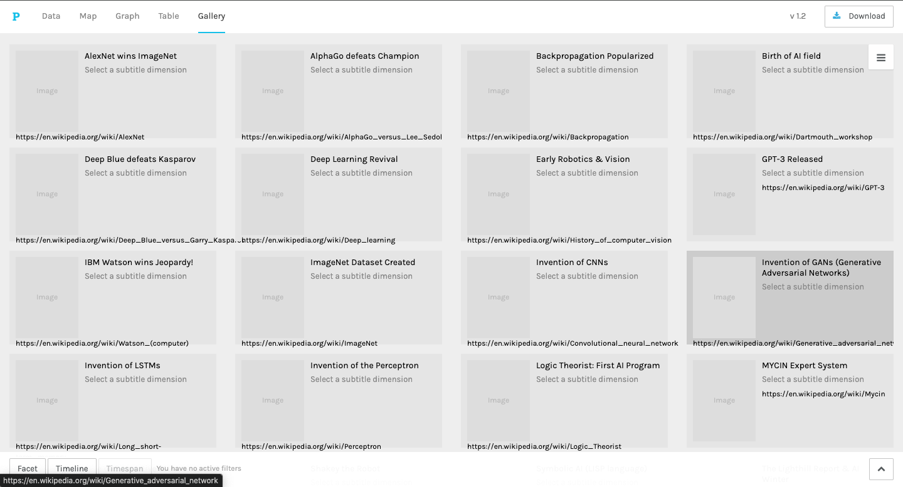

# An Interactive Visualization of AI History

This project explores the history of Artificial Intelligence from its conceptual beginnings to the modern era of generative models. The data was compiled and visualized using Palladio to show the key institutions behind major breakthroughs, where these events happened, and how progress unfolded over time.

---

### Dashboard Views

| Map View | Graph View | Gallery View |
| :---: | :---: | :---: |
|  |  |  |

---

## Project Source and Data Files

All files for this project are hosted in the official GitHub repository.

**[Click here to visit the project repository](https://github.com/VectorTeller/AiHistory-PalladioVisualization)**

The repository contains the two key files mentioned in the instructions below:
*   `historyai.json`: The complete, saved Palladio project with all visualizations pre-built.
*   `HistoryAI.csv`: The raw data file used to build the project.

---

## How to View the Interactive Project

This project was built using [Palladio](https://hdlab.stanford.edu/palladio/), a browser-based tool for visualizing historical data.

1.  **Go to the project repository** (using the link in the section above) and download the **`historyai.json`** file from the `/data` folder.
2.  Go to the [Palladio start page](https://hdlab.stanford.edu/palladio/).
3.  Click the link that says **"Load an existing project (.json)"**. 
4.  Select the `historyai.json` file you just downloaded from your computer.

The complete, interactive dashboard will appear in your browser, with all visualizations ready to explore.

---

## How to Build the Project from Scratch 

If you want to build the project yourself using the raw data:

1.  **Go to the project repository** and download the **`HistoryAI.csv`** file from the `/data` folder.
2.  Go to the [Palladio start page](https://hdlab.stanford.edu/palladio/).
3.  Under the section **"Create a new project,"** drag and drop your downloaded **`HistoryAI.csv`** file into the box that says "Load .csv or spreadsheet."

